# 安卓应用在线人脸识别调研报告

by  --  [lisongting](https://github.com/lisongting)

我调研了以下几家主流公司的在线人脸识别方案：

* 科大讯飞
* 腾讯优图
* 百度
* 阿里云
* Face++旷视

## 科大讯飞在线人脸识别

[讯飞开放平台链接](http://www.xfyun.cn/)

科大讯飞的在线人脸识别需要使用SDK，其人脸识别服务并不是通过直接发起HTTP请求，而是通过使用SDK中写好的类，设置一系列参数后，再进行写数据，其网络请求对开发者并不透明，SDK中的一些类只是作为网络请求代理。

使用科大讯飞的人脸识别服务，步骤如下：

* 注册登录成为开发者
* 创建应用
* 下载SDK并集成
* 人脸识别流程
  * 创建用户组
  * 注册人脸
  * 加入用户组
  * 识别人脸

测试科大讯飞的人脸识别(使用XbotPlayer测试，注册和识别部分的代码改用科大讯飞的方式实现)：

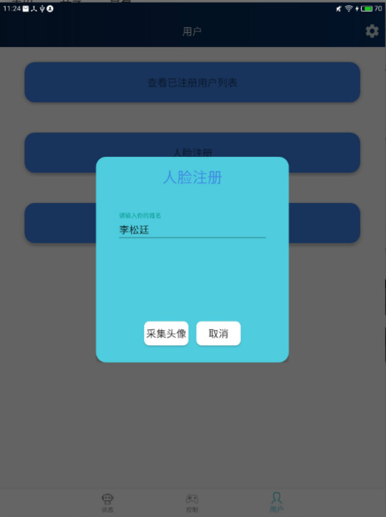

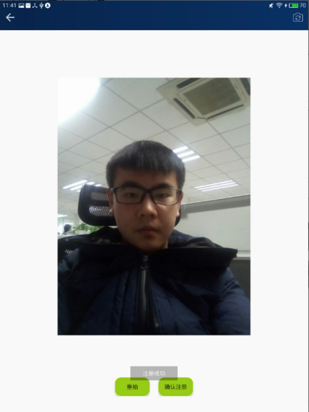

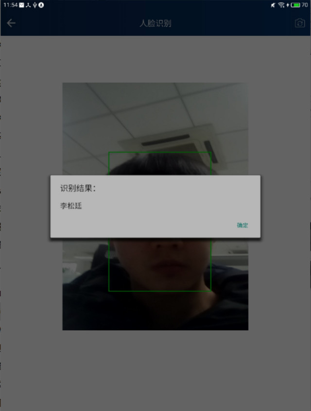

科大讯飞的人脸识别速度很快，1到2秒就识别出来了。

但科大讯飞的人脸识别服务有以下一些缺点：从人脸识别服务的角度，人脸只能进行注册、识别、删除，不支持查询。从SDK角度，科大讯飞的SDK写的并不合理，很多时候都是让开发者设置许多参数来完成特定功能，而这些参数又全是缩写，怎样组合，官方文档中并没有详细的说清楚，而且人脸识别服务的响应都是采用相同的回调，感觉这SDK设计得并不好。

## 腾讯优图在线人脸识别

[腾讯优图AI开放平台链接](http://open.youtu.qq.com)

腾讯优图的人脸识别服务不错，相比科大讯飞，腾讯优图不需要在APP中集成SDK，腾讯优图提供了在线人脸识别的API，使用腾讯优图人脸识别服务，步骤如下：

* 注册登录成为开发者
* 创建应用
* 开放平台给应用分发AppID，SecretID，和SecretKey
* 生成签名
* 调用OpenApi，发起Http请求-->得到响应 

腾讯优图需要开发者自行使用AppID，SecretID，和SecretKey生成签名，这一步比较麻烦，不过官方提供了各种语言如何生成签名的demo，签名有一定的有效期，生成签名后将签名信息放在`Authorization` 请求头中。

腾讯优图提供的人脸识别服务很多，也比较全，从个体创建到人脸的增删改查都有：

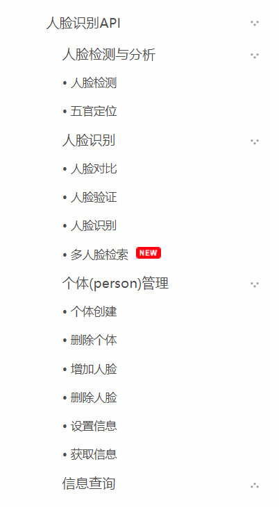

写了一个程序测试人脸识别效果：

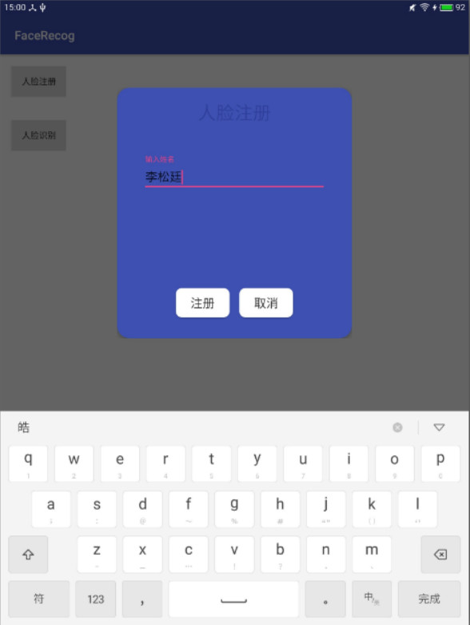

调用在线API进行注册：

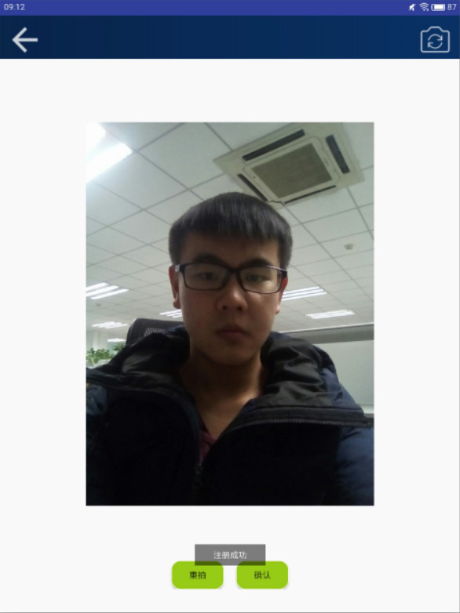

识别测试。腾讯优图的识别效果还不错，快的时候两三秒就识别出来了，但是有的时候识别精度不够理想，识别时间稍长(5-10秒)。

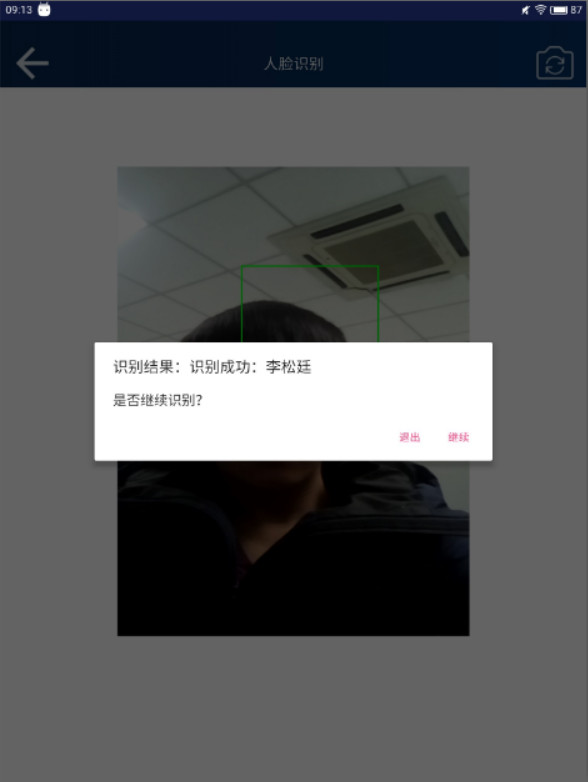

## 百度开放平台人脸识别

[百度AI开放平台链接](http://ai.baidu.com/)

我首先看了百度人脸识别的API，是RESTFUL的API风格，但是要使用百度的人脸识别服务需要申请企业认证，然后才能下载SDK。

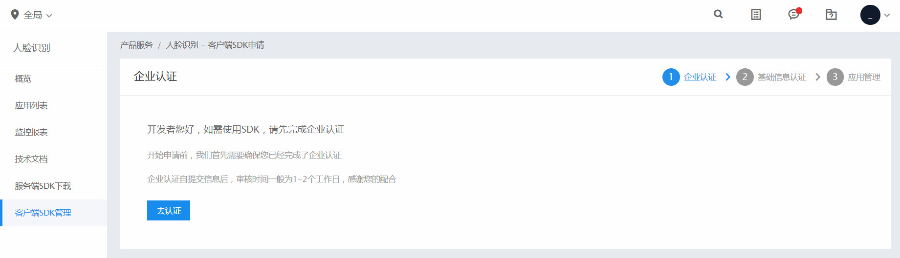

进行企业认证还要填写注册号和上传营业执照。

下面的是百度人脸识别计费说明。

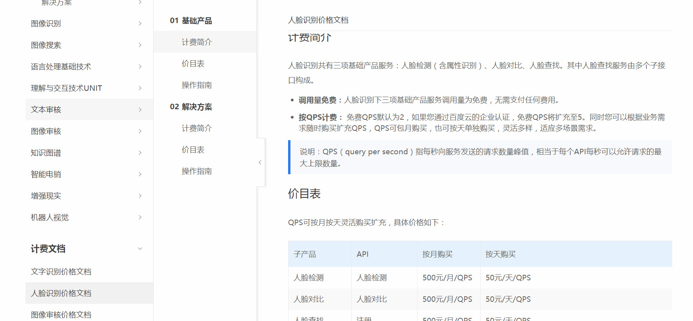

## 阿里云

[阿里云链接](https://www.aliyun.com/)

阿里云在人脸识别这个领域并没有其他几家做得好，阿里云中关于人脸识别的服务只有以下几种：人脸检测定位，人脸属性识别和人脸比对。如下图：

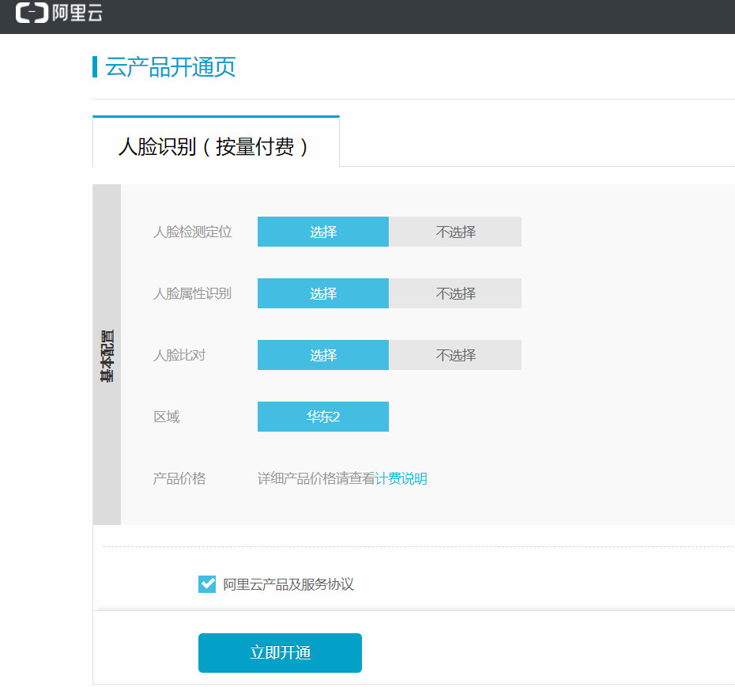

阿里云提供的这三种服务也是以Http接口的形式发起请求的，这三种服务是这样的：

* 人脸检测定位：上传一张图片，然后服务器给我返回人脸的位置和置信度等。
* 人脸属性识别：上传一张图片，服务器返回人脸的姿态、特征点、瞳孔坐标、年龄推测等等信息。
* 人脸比对：上传两张图片，服务器判断这两张图片是否是同一个人。

我们想要的是对用户进行人脸注册，然后能识别出具体是哪个用户。阿里云提供的服务并不能满足我们的需求。

##  旷视Face++ 

[Face++旷视人工智能开放平台链接](https://www.faceplusplus.com.cn)

Face++的人脸识别也是通过HTTP请求的方式发起的，人脸服务分为试用版和付费版，试用版的是免费，但是功能有限，我使用的是试用版。

Face++人脸识别要经过如下步骤：

* 注册、登录、成为开发者

* 获取API Key 和API Secret

* 调用人脸接口服务

  * (1)首先要传入一张人脸图片进行检测，可以以三种方式上传，图片URL,图片文件，图片的base64字符串。Face++会返回该人脸的Token。
  * (2)调用接口创建一个人脸集合(FaceSet)，每个FaceSet也有一个token相互对应
  * (3)将第一步得到的人脸token加入到人脸集合中，前三步相当于"注册"
  * (4)人脸识别是以“搜索”的方式进行的，需要识别时，上传一张人脸图片P，并指定人脸集的token，调用服务接口进行人脸搜索，服务端会返回给我与P最相近的前n张人脸token，以此来达到人脸识别目的。

  ​

Face++的试用截图(还是使用了FaceRecog程序，但是代码和请求方式都改为Face++的形式)：

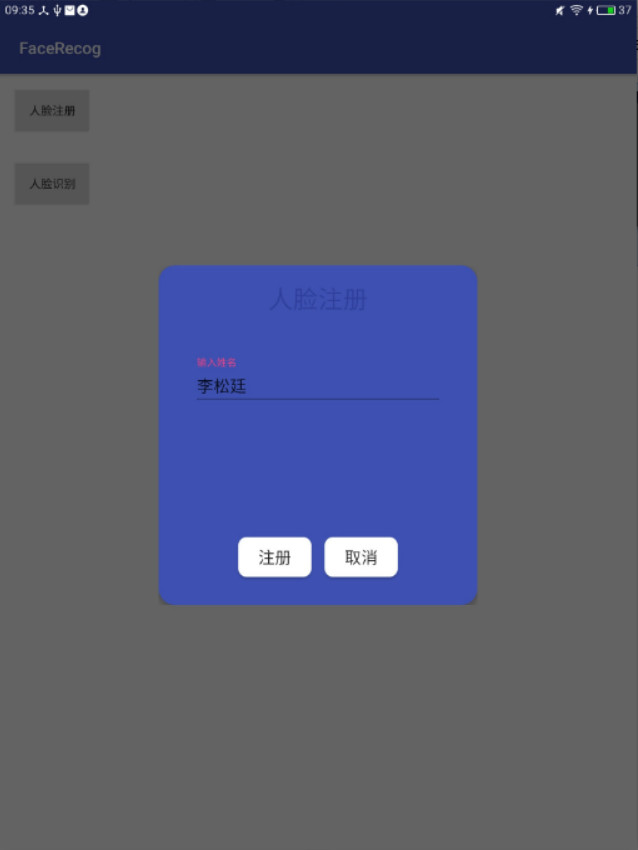

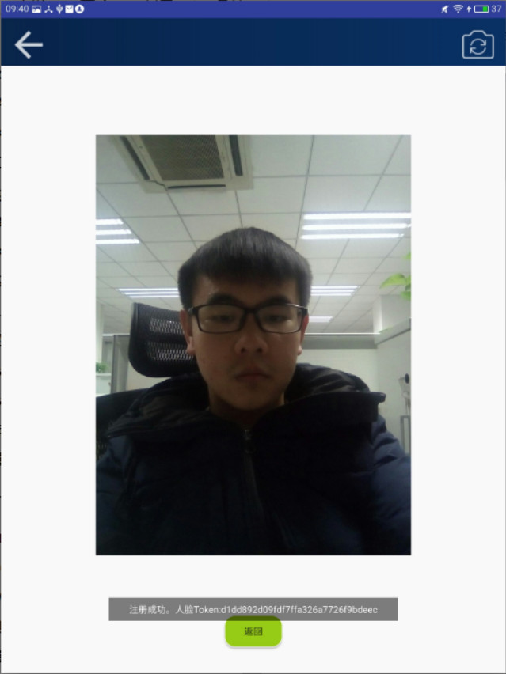

Face++给我返回了人脸Token，这个标识符是唯一的。

识别结果：

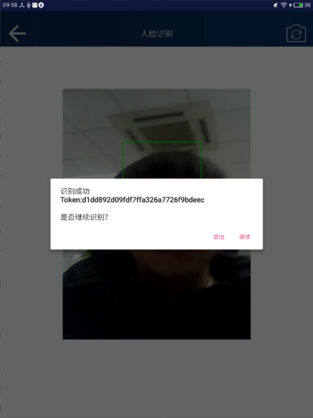

Face++的识别速度还可以，准确率也不错。但是Face++并不允许我们在添加人脸的时候就指定用户姓名，所以我这里就直接把Token显示出来了。如果想要指定姓名还需要再次调用一个Update API，对人脸设置姓名。

Face++的接口和服务都比较稳定，但是唯一不足的是，需要调用多个API，流程稍繁琐。比如注册功能，我就需要连续调用三个API：检测人脸-->创建人脸集---->添加到人脸集。

下面对科大讯飞、腾讯优图、Face++的人脸识别进行对比，下面是一个对比表格：

|        | 是否需要SDK | 是否提供HTTP接口 | 识别速度 | 识别精度 | 说明文档 | 是否免费  |
| :----: | :-----: | :--------: | :--: | :--: | :--: | :---: |
|  科大讯飞  |    是    |     否      |  一般  |  一般  | 不清晰  |   是   |
|  腾讯优图  |    否    |     是      | 1-2秒 |  好   |  清晰  |   是   |
| Face++ |    否    |     是      | 1-2秒 |  较好  |  清晰  | 试用版免费 |

