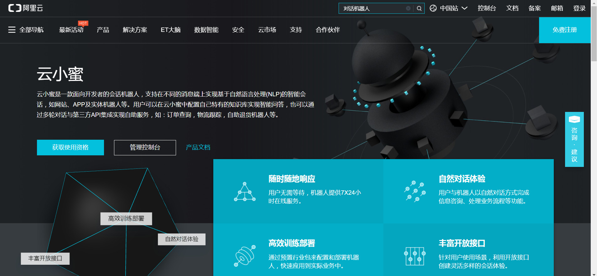
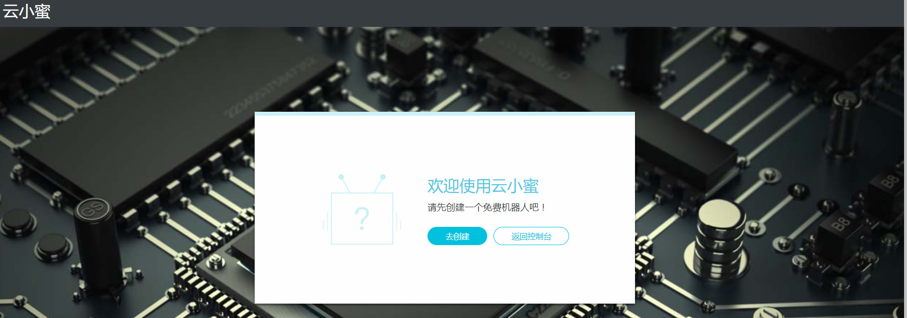
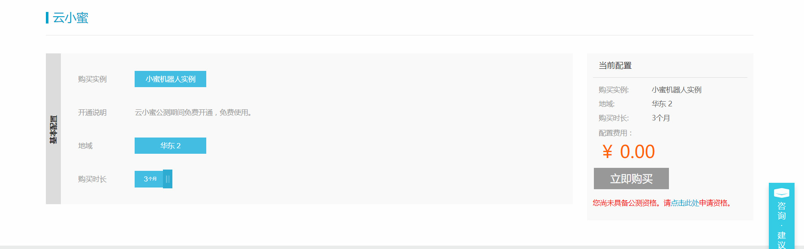
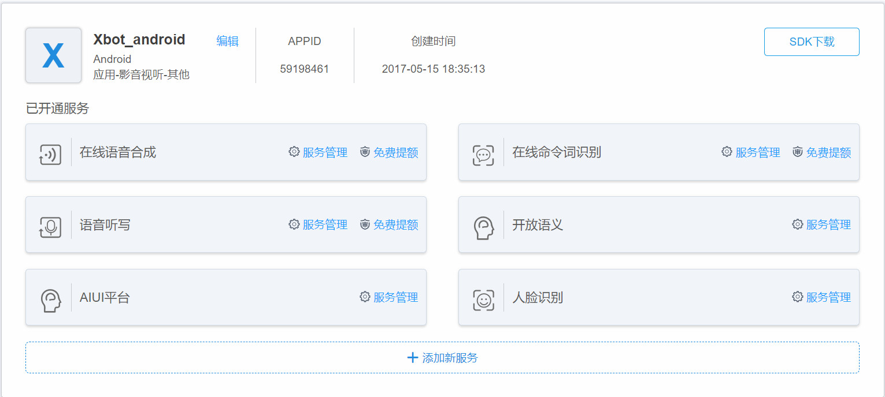
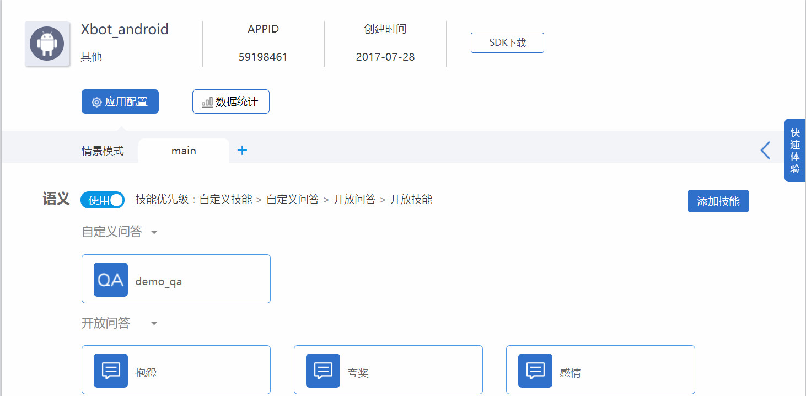
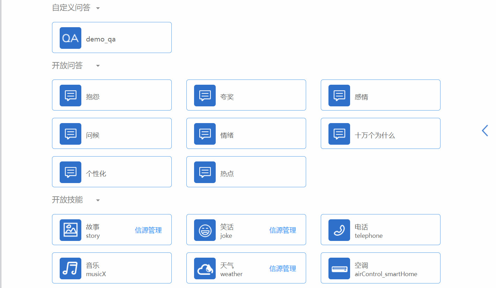
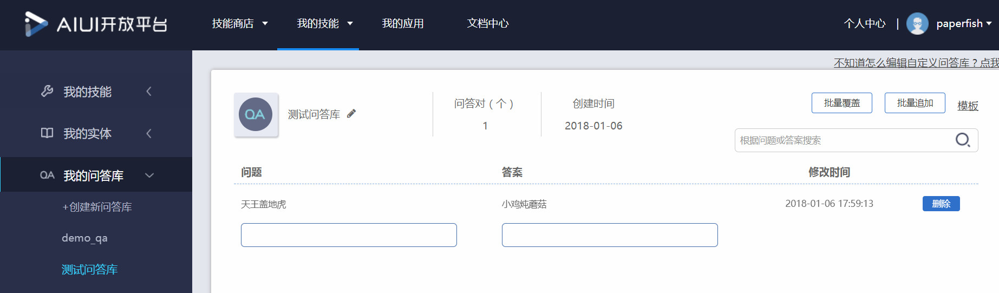
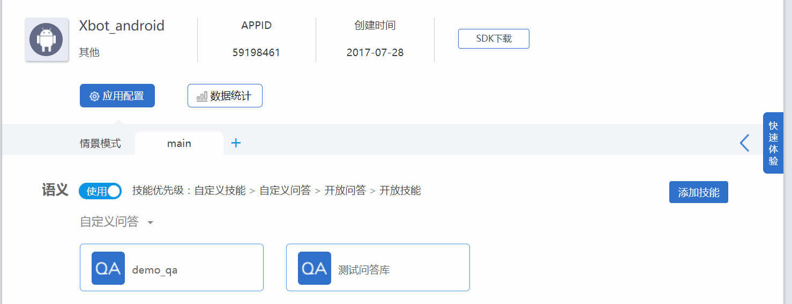
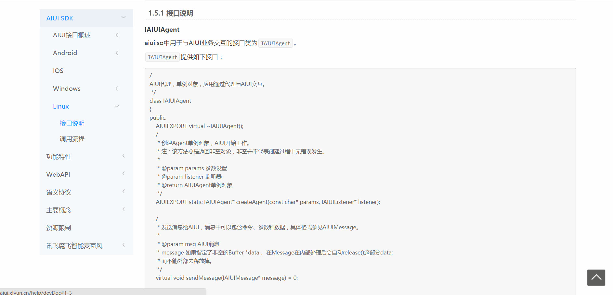

# 安卓应用在线语音对话调研报告 

写作者 ： [lisongting](https://github.com/lisongting)

日期： 2018年1月7日

在语音识别、智能对话这方面，科大讯飞无疑是行业的佼佼者。

其实百度云和阿里云也推出了智能对话服务，先看看百度云的对话机器人吧，百度的对话机器人页面只有一个"合作咨询" 按钮，并没有提供一系列SDK、API和使用文档，看来百度云的对话机器人还没有做到足够好，连基础的开发文档都提供不了。

再来看看阿里云的对话机器人服务，阿里云提供了一个“云小蜜”对话机器人服务，其页面如下

点击"产品文档"后，跳出这样的页面：让我先创建一个免费机器人

点击"去创建"，结果是这样的页面：

右下角写着"您尚未具备公测资格。请点击此处申请资格"。 

我查了一下云小蜜的发布时间，云小蜜是2017年10月12日在阿里云栖大会上发布的，上线才两个多月，目前还处于公测阶段，其技术成熟度估计比不上科大讯飞。科大讯飞的AIUI(人工智能时代的人机交互界面)产品是于2015年12月21日就已经发布上线，经过两年的发展，技术和服务较成熟。

##  正文开始 

下面将重点介绍科大讯飞的AIUI语音对话服务，官方提供了一个视频来帮助开发者了解AIUI，[视频链接](http://ai.xfyun.cn/course/courseDetail?id=1)。

在科大讯飞的管理控制台，"我的应用"界面，创建应用之后，会得到一个APPID，然后添加新服务，选择添加**AIUI平台** ，这个AIUI平台就包含科大讯飞的对话机器人服务，也可以添加一些其他的服务，如人脸识别、语音听写等。这个Xbot_android应用是我之前在使用在线语音合成服务的时候就创建好的了，添加了**AIUI平台** 服务后，可以在已开通服务中看到。如下图，我已经开通的AIUI平台服务。

点击AIUI平台右边的**服务管理** ，进入到服务配置页面。

这个配置界面可以添加许多的对话库，在右方有一个**添加技能** 按钮，点击这个按钮后可以给当前应用增加对话库，科大讯飞提供了一些基础的对话服务，包括问候、抱怨、情绪、夸奖等等。这些对话库我都添加进去了。

我写了一个测试程序，主界面是这样的：

在文本框中输入对话内容，点击"进行文本对话"可以进行文本对话。点击**进行语音对话** ，首先会进行录音，接着调用讯飞的AIUI对话服务，服务端给我返回的是json字符串，其中就包含应答的内容(我会把应答的内容展现在界面上)，然后我再使用TTS将应答文本转为语音播放出来就可以了。这样就实现了语音对话的功能。

下面我主要测试语音对话，当我对着手机说了一句"你好"，得到了这样的返回结果：

我再使用TTS将返回结果转成语音，"你好啊，我是语音机器人"可以正确的播放出来，效果不错。

前面在配置应用的时候，我是添加了"天气"技能的。我对着手机说了一句"北京的天气怎么样"，获得返回结果如下：

在前面配置应用时，我还添加了开放式问答"十万个为什么"服务，我又对着手机说了一句"为什么会打雷"，得到的结果如下：

上面就是对一些基础的语音对话功能进行测试。

如果需要满足特定场景下的语音对答需求，这就需要我们自行配置对答库。

我创建了一个自定义问答库，名字叫做"测试问答库"，添加了一个对答条目，问"天王盖地虎"，答"小鸡炖蘑菇"。

创建好自定义问答库后，在配置界面将自定义问答库添加到APP中。

下面来测试一下。

我对着手机说"天王盖地虎"，获得的返回结果如下：

自定义问答库测试成功。

以上就是关于讯飞语音对话服务在Android应用上的测试。

如果不借助安卓设备来完成机器人上的语音交互，讯飞也提供了Linux平台开发文档:

附 ： [AIUI开发文档链接](http://aiui.xfyun.cn/help/devDoc) 

